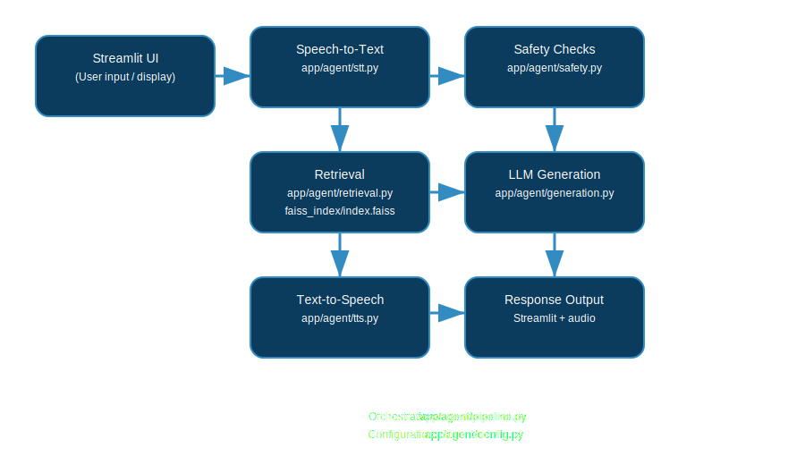

# Naija‑Agro‑Chat

An AI‑powered conversational assistant tailored for Nigerian agriculture.  
This project integrates speech‑to‑text, text generation, retrieval over domain documents, and text‑to‑speech to deliver an interactive experience via a Streamlit frontend.

---

## 📌 Features

- **Speech‑to‑Text (STT)** for capturing user queries verbally.
- **Text Generation** using an LLM to answer agricultural questions (passes the current date so the model can reason about time-sensitive items).
- **Agentic reasoning (tools + retrieval)**: an optional LangChain agent decides whether to answer directly or call tools like the knowledge base (FAISS) and a web search.
- **Conversation memory**: chat history is stored in the session and included in prompts for better follow‑ups.
- **Multilingual support**: detects query language, translates non‑English queries for retrieval, and keeps answers in the user’s language.
- **Safety checks and moderation** to filter inappropriate or unsafe inputs.
- **Text‑to‑Speech (TTS)** to read responses aloud.
- **Streamlit UI** for web‑based interaction.

---

## 📁 Repository Structure

```
.
├── app/
│   ├── streamlit_app.py          # entry point for the Streamlit front end
│   ├── agent/                    # core AI “agent” modules
│   │   ├── config.py             # configuration/constants
│   │   ├── generation.py         # LLM prompt building & text generation
│   │   ├── ingestion.py          # document ingestion helpers
│   │   ├── pipeline.py           # orchestration of retrieval & generation
│   │   ├── retrieval.py          # FAISS index search logic
│   │   ├── safety.py             # input/output safety checks
│   │   ├── stt.py                # speech‑to‑text helper
│   │   ├── tts.py                # text‑to‑speech helper
│   │   └── __init__.py
│   └── agent/…                    # other supporting modules
├── config/
│   └── settings.py               # environment/configuration settings
├── docs/                         # additional documentation
├── faiss_index/
│   └── index.faiss               # prebuilt FAISS vector index
├── requirements.txt              # Python dependencies
└── README.md                     # this file
```

---

## ⚙️ Setup & Installation

1. **Clone the repository**

   ```bash
   git clone https://github.com/your_org/NaijaAgroChat.git
   cd NaijaAgroChat
   ```

2. **Create a Python environment**

   ```bash
   python -m venv .venv
   .venv\Scripts\activate        # Windows
   source .venv/bin/activate     # macOS/Linux
   ```

3. **Install dependencies**

   ```bash
   pip install -r requirements.txt
   ```

4. **Configuration**

   - Edit `config/settings.py` to supply API keys (e.g. OpenAI, short‑term STT/TTS credentials) and other environment variables.
   - Adjust model names, FAISS path, or any constants inside `app/agent/config.py` as needed.

5. **Prepare data (optional)**

   Run any ingestion scripts in `app/agent/ingestion.py` to build or update the FAISS index from your own documents; the prebuilt index lives in `faiss_index/index.faiss`.

6. **Run the app**

   ```bash
   python -m streamlit run streamlit_app.py
   ```

   The UI will be served locally (usually at `http://localhost:8501`).

---

## 🚀 Usage

- **Web UI** – Type or speak questions about Nigerian agriculture; the agent responds in text and voice.
- **Programmatic** – Import components from `app.agent` to build custom workflows or CLI tools.

---

## 🔍 Architecture Overview



### 1) Frontend & Session Memory
- `streamlit_app.py` manages the UI and keeps a short **conversation history** in `st.session_state.chat_history`. This history is passed into the pipeline so follow-up questions can be answered in context.
- Users can input via **text** or **voice** (microphone upload).

### 2) Speech‑to‑Text (STT)
- Audio inputs are handled by `app/agent/stt.py` (Spitch) to transcribe spoken queries into text.
- The detected language drives later localization decisions.

### 3) Input Safety Screening
- Inputs that may involve chemicals/dosages are checked with `app/agent/safety.py` and a dedicated safety LLM (`Config.OPENAI_SAFETY_MODEL`).
- If unsafe content is detected, the system abstains with a safe fallback message.

### 4) Language Handling & Retrieval
- Non-English queries are translated into English for better retrieval quality.
- `app/agent/retrieval.py` searches the FAISS vector index (`faiss_index/index.faiss`) to find relevant passages from the knowledge base.
- If no documents are found, the system can optionally fall back to **web search** (`app/agent/web_search.py`) to gather recent information.

### 5) Agentic Mode (Tool‑Enabled Reasoning)
- When enabled via `NaijaAgroChat.build(use_agent=True)`, the system runs a **LangChain React agent** that can decide whether to:
  - Answer directly
  - Call the **knowledge base tool** (retrieval over FAISS)
  - Call the **web search tool** (live search results)
- The agent receives a short slice of recent conversation history and is expected to keep replies in the same language as the user.

### 6) Response Generation
- Prompts are assembled in `app/agent/generation.py`, combining:
  - the user query
  - retrieved context or tool outputs
  - recent conversation history
  - the current date (so time-sensitive reasoning works)
- The generator uses an LLM (e.g., OpenAI GPT via `langchain_openai.ChatOpenAI`).

### 7) Post‑processing & Output Safety
- Generated answers are re-checked by `app/agent/safety.py` when queries are potentially dangerous.
- Safe responses are returned to the frontend along with source citations.

### 8) Text‑to‑Speech (TTS)
- `app/agent/tts.py` converts final answers into speech audio (Spitch), using a language-appropriate voice.

---

---

## 🛠 Development

- **Adding new data**: Update ingestion routines and rebuild FAISS index.
- **Changing models**: Modify `config.MODEL_NAME` or related constants.
- **Extending functionality**: New pipelines or commands belong under `app/agent/`.

Helpful commands:

```bash
# linting / formatting
flake8 app tests
black .

# run tests (add tests under a tests/ directory)
pytest
```

---

## 🤝 Contributing

1. Fork the repo and create a branch.
2. Ensure code follows style guidelines and includes tests.
3. Open a pull request describing your changes.
4. Be sure to update this README if behavior or configuration changes.

---

## 📄 License

Specify your license here (e.g. MIT, Apache‑2.0).

---

## 📝 Acknowledgments

- Built with [Streamlit](https://streamlit.io/)
- Uses [FAISS](https://github.com/facebookresearch/faiss) for vector similarity search
- Powered by [OpenAI](https://openai.com/) or whichever backend you configure

---

> Let me know if you’d like a condensed README for end‑users, or additional developer docs in `docs/`.
